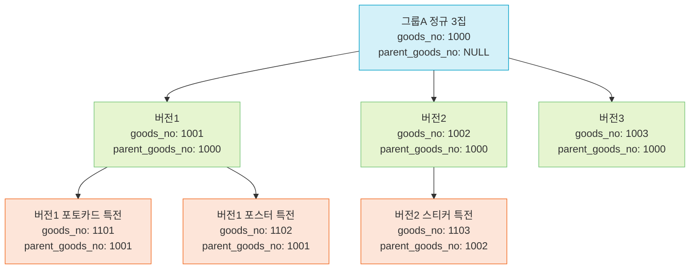
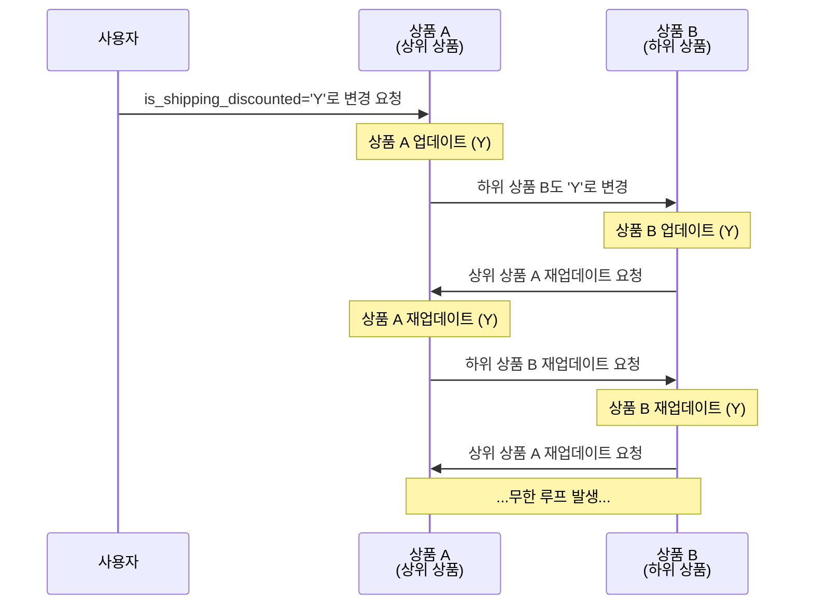
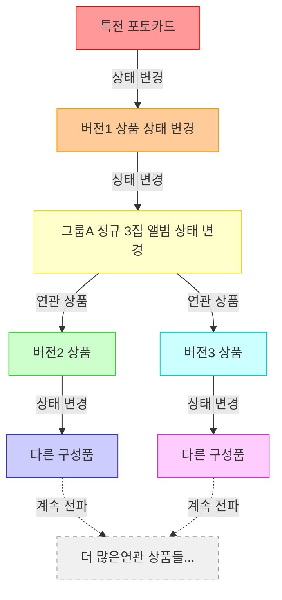
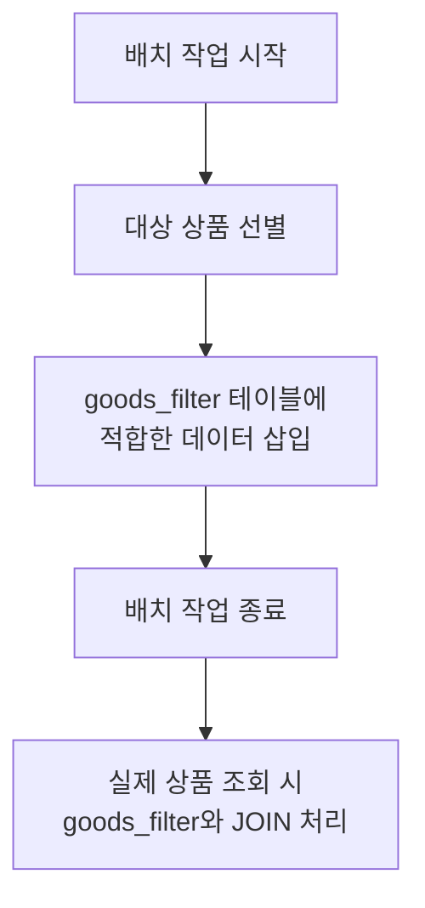

## 들어가며

배치성 작업으로 보이는 업무가 있을 때, 이것이 정말 배치 처리로만 해결 가능한 문제인지 고민하게 됩니다. 애플리케이션에서 직접 처리하거나 이벤트 스트리밍 같은 방법으로 문제를 해결한다면 실시간성이 확보되고 자원도 더 효율적으로 사용할 수 있기 때문입니다.

하지만 이번에 소개할 사례는 다양한 대안을 검토했음에도 결국 배치 처리를 선택할 수밖에 없었던 케이스입니다.

## 1\. 문제 상황

### 1.1 기존 구조 및 접근 방식

저는 이커머스 플랫폼을 운영하고 있으며, 다양한 유형의 상품을 판매하고 있습니다. 상품 데이터베이스에서 `goods` 테이블은 다양한 상품 정보를 저장하는 핵심 테이블입니다. 이 테이블에 `is_shipping_discounted` 라는 컬럼이 있고, 해당 상품이 배송비 할인 대상인지 여부를 나타내고 있었습니다. 이 방식은 다음과 같이 간단한 쿼리로 배송비 할인 상품을 조회할 수 있습니다.

```sql
select *
from goods
where is_shipping_discounted = 'Y'

```

### 1.2 문제점 발견

그러나 상품이 배송비 할인 대상인지 판단하기 위해서는 해당 상품뿐만 아니라 모든 하위 상품의 상태까지 함께 확인해야 하는 문제가 있었습니다.



이러한 복잡한 계층 구조에서 "그룹A 정규 3집" 앨범을 배송비 할인 상품으로 올바르게 표시하려면, 모든 버전과 그에 속한 모든 특전 상품들의 상태까지 함께 확인해야 합니다.

이로 인해 다음과 같은 주요 문제가 발생합니다:

1. **페이지네이션 구현의 어려움**: 모든 상품을 확인해야 하므로 일반적인 페이지네이션 방식을 적용하기 어려워집니다.
    
2. **코드 복잡성 증가**: 여러 계층의 상품 정보를 확인하기 위해 중첩된 서브쿼리와 다중 조인이 필요해져 코드가 복잡해집니다. 이는 개발자가 코드를 이해하고 유지보수하는 데 어려움을 초래합니다.
    

## 2\. 대안 검토

### 2.1 CDC 기반 처리 방식

처음에는 상위 상품의 배송비 할인 상태가 변경될 때, 하위 상품들의 상태도 함께 변경하는 이벤트 기반 처리 방식을 검토했습니다. 사내에서 이미 MSK Connect를 사용하고 있었기 때문에 `is_shipping_discounted` 값의 변경을 감지하고 연관된 상품들에 전파하는 방식을 고려했습니다.

진행 과정:

1. 상품의 배송비 할인 상태가 변경됨
    
2. 이 변경이 MSK Connect를 통해 이벤트로 발행됨
    
3. 이벤트 컨슈머가 이 변경을 감지하고 관련 하위 상품들의 상태 변경
    

그러나 팀 내에서 MSK Connect를 다양한 케이스에 적용한 경험이 아직 없었고, 전문가가 부재하다고 판단했습니다. 또한 문제 해결을 위해 CDC 방식을 도입하는 것이 현 상황에서 오버엔지니어링이 아닐지 고민하게 되었습니다.

### 2.2 애플리케이션 내 처리 방식

다음으로 애플리케이션 레벨에서 상품의 배송비 할인 상태 변경 시 하위 상품들도 함께 변경하는 방식을 검토했습니다. 상품 수정 기능은 이미 애플리케이션에서 지원하고 있었기 때문에, 기존 기능을 확장하여 해결하는 방식을 고려했습니다.

```java
public void update(final Long goodsNo) {
    updateProduct(goodsNo);
    updateAllChildProducts(goodsNo); // 추가 되는 코드
}
```

이 방식은 기존 애플리케이션 구조를 크게 변경하지 않고도 구현할 수 있어 유력한 대안으로 고려되었습니다.

### 2.3 기획 변경과 새로운 문제점

그러나 기획이 변경되어 상위/하위 상품 간 양방향 상태 동기화가 요구되었습니다:

* 상위 상품의 상태가 변경되면 하위 상품의 상태도 변경
    
* 하위 상품의 상태가 변경되면 상위 상품의 상태도 변경
    

### 2.4 양방향 동기화의 문제점

### 2.4.1 순환참조 발생 가능성

양방향 동기화는 다음과 같은 순환참조 문제를 야기할 수 있었습니다:



### 2.4.2 영향 범위 예측 불가

상품의 depth가 깊은 경우, 상태 변경의 전파 범위가 매우 넓어질 수 있었습니다. 이러한 구조에서는 상태 변경 관리가 거의 불가능한 수준이 될 수 있었습니다.



## 3\. 최종 해결책: 배치 처리

### 3.1 배치 작업 구현

다양한 대안을 검토한 결과, 결국 배치 처리 방식을 선택했습니다. 상품 테이블의 배송비 할인 상태를 확인하고 별도의 필터 테이블에 데이터를 저장하는 방식으로 구현했습니다.

새로운 필터 테이블을 다음과 같이 생성했습니다:

```sql
create table goods_filter (
  id int auto_increment primary key,
  shop_no int not null,
  goods_no int not null,
  filter_type varchar not null,
  created_at datetime(6) default current_timestamp(6) not null)
  comment '상품 필터링을 위한 테이블';

```

그리고 배송비 할인 상품 정보를 다음과 같이 삽입했습니다:

```sql
insert into goods_filter (shop_no, goods_no, filter_type)
values (1, 99999, 'delivery_discount');

```



### 3.2 장점

이 방식의 장점은 다음과 같습니다:

1. 상품 조회 시 `goods_filter` 테이블을 JOIN하여 간단하게 배송비 할인 여부 판단 가능
    
2. `goods` 테이블의 상태 변경을 제한하여 시스템 안정성 확보
    
3. 상위-하위 상품 간 복잡한 상태 전파 로직이 필요 없어짐
    

## 4\. 결론

### 4.1 문제 요약

이 사례에서 우리는 다음과 같은 문제들을 직면했습니다:

1. **복잡한 상품 계층 구조**: 부모-자식-손자로 이어지는 상품 구조에서 배송비 할인 상태를 일관되게 관리해야 했습니다.
    
2. **양방향 동기화 요구**: 상위 상품과 하위 상품 간의 양방향 상태 동기화가 필요했으며, 이는 순환참조와 무한 업데이트 루프 위험을 초래했습니다.
    
3. **영향 범위 예측 불가**: 특히 복잡한 계층 구조에서 한 상품의 상태 변경이 연쇄적으로 얼마나 많은 상품에 영향을 미칠지 예측하기 어려웠습니다.
    
4. **조회 성능 저하**: 중첩된 서브쿼리와 다중 조인으로 인한 성능 문제가 발생했습니다.
    

### 4.2 배치 처리의 근거

배치 처리 방식을 선택한 이유는 다음과 같습니다:

1. **복잡성 최소화**: CDC 작업은 현 팀의 전문성과 리소스를 고려할 때 오버엔지니어링이 될 수 있었습니다.
    
2. **순환참조 문제 해결**: 별도의 필터 테이블을 사용함으로써 상품 상태 변경의 양방향 전파로 인한 순환참조 문제를 근본적으로 해결할 수 있었습니다.
    
3. **시스템 안정성 확보**: 복잡한 실시간 처리 대신 배치로 처리함으로써 시스템에 가해지는 부담을 분산시키고, 예측 가능한 시간에 작업을 수행할 수 있게 되었습니다.
    
4. **조회 성능 개선**: 별도의 테이블을 활용한 단순 JOIN으로 복잡한 계층 구조 탐색 없이 배송비 할인 상품을 빠르게 조회할 수 있게 되었습니다.
    

물론 배치 처리는 실시간성이 떨어진다는 단점이 있지만, 배송비 할인 정보의 약간의 지연이 비즈니스에 미치는 영향이 크지 않다고 판단했습니다. 결과적으로 이 접근 방식은 복잡한 상품 계층 구조 속에서 배송비 할인 상태를 효과적으로 관리하면서도 시스템의 안정성과 성능을 유지할 수 있게 해주었습니다.

이 사례는 모든 문제를 한 번에 해결하기 위한 완벽한 아키텍처를 구현하기보다, 현재 상황에 맞는 실용적인 접근 방식이 더 효과적일 수 있음을 보여줍니다. 기술 선택은 항상 현재 팀의 역량, 비즈니스 요구사항, 그리고 장기적인 유지보수 관점을 균형 있게 고려하여 이루어져야 합니다. 중요한 것은 완벽함보다 실질적인 문제 해결과 지속 가능한 시스템 구축에 초점을 맞추는 것입니다.