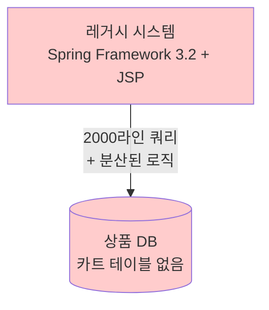
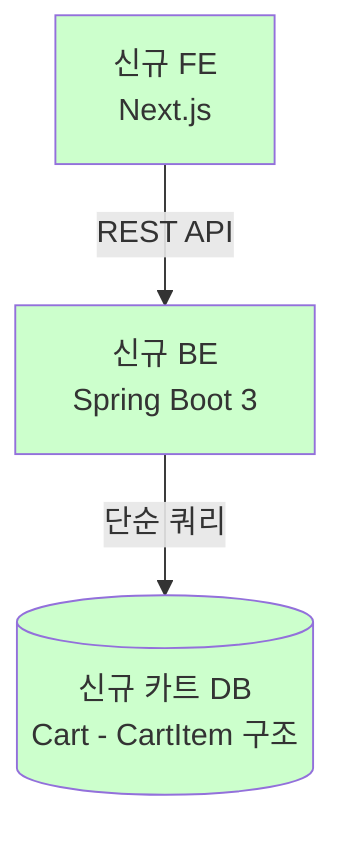

## **들어가며**

약 1년 반에 걸쳐 진행한 카트와 주문서 개선 프로젝트가 최근 완료되었습니다. 처음에는 전체적인 그림이 보이지 않아 막막했지만, 완료하고 나니 그 과정에서 많은 배움이 있었습니다. 미래의 내가 비슷한 상황을 마주했을 때 참고할 수 있도록, 당시의 맥락과 의사결정, 그리고 그 결과를 정리하려고 합니다.

제가 속한 팀에서 운영하는 서비스는 글로벌 이커머스입니다. 해외 주문이 주를 이루다 보니 해외배송, 환율, 세금, 다국어 처리 등 일반 커머스 대비 추가적인 비즈니스 복잡도가 있습니다. 이런 비즈니스 복잡도에 레거시 시스템의 기술적 복잡도까지 더해진 상황이었습니다.

이번 글에서는 이 프로젝트를 시작하게 된 배경과 당시 직면했던 문제들을 공유하고자 합니다.

## **1\. 문제의 시작: 기술 부채의 증상들**

### **1.1** 거대한 단일 쿼리

카트 조회 쿼리가 약 2,000라인에 달했습니다. 이 쿼리 안에는 상품 유형별 처리 로직, 세금 계산, 환율 계산, 할인 적용, 재고 확인 등 복잡한 비즈니스 로직이 포함되어 있었습니다.

또한 카트와 주문에서 동일한 쿼리를 사용하고 있어서 유스케이스가 다름에도 각각에 맞춰 개선하기 어려웠습니다. 한쪽을 수정하면 다른 쪽에 영향을 미치는 상황이었습니다.

성능 문제도 심각했습니다. 카트에 상품이 약 40개 정도만 넘어가면 타임아웃이 발생했습니다. 단일 쿼리로 개선할 수 있는 방법은 대부분 적용했고, 추가 개선을 위해서는 쿼리 분리가 필요했습니다. 하지만 리소스 투입이 많을 것으로 예상되어 우선순위를 낮춘 상태였습니다.

결국 고객 문의가 들어오면 "카트에 상품이 많아서 발생한 문제"라고 안내하고, 카트를 초기화해드리는 방식으로 대응할 수밖에 없었습니다.

### **1.2 분산된 비즈니스 로직**

비즈니스 로직이 프론트엔드(FE), 백엔드(BE), 데이터베이스(DB) 세 곳에 분산되어 있어 유지보수가 어려웠습니다.

### **1.3 DB에 카트 테이블이 없음**

일반적으로 카트 시스템은 "카트(Cart) - 카트아이템(CartItem)" 구조로 설계됩니다. 카트가 하나의 장바구니를 나타내고, 그 안에 여러 카트아이템이 담기는 형태입니다.

하지만 레거시 테이블에는 카트 테이블이 없었습니다. 카트아이템만 존재했고, 이 데이터가 세션 정보와 함께 관리되고 있었습니다. 이로 인해 카트의 생애주기 관리가 불가능했습니다. 예를 들어 카트가 언제 생성되고 언제 삭제되는지 추적할 수 없었습니다.

## **2\. 개선을 시작한 배경**

이 문제들은 오래전부터 알고 있었습니다. 하지만 우선순위는 높지 않았습니다. 트래픽이 몰리면 장애가 발생하는 상황이었고, 장애 대응과 시스템 안정화가 급선무였기 때문에 본질적인 개선은 뒤로 미뤄둘 수밖에 없었습니다.

하지만 시스템이 안정화되었습니다. 트래픽이 몰려도 큰 장애로 번지지 않는 수준이 되었고, 이제 본질적인 개선을 시작할 수 있는 상황이 되었습니다. 카트와 주문에 대한 요구사항을 매번 임시방편으로 반영하는 비효율도 계속 누적되고 있었습니다.

주문서에 반영해야 하는 요구사항이 많았습니다. 하지만 1.1에서 언급한 쿼리를 개선하면서 요구사항을 반영하는 것보다 새로운 시스템을 만들어서 요구사항을 반영하는 것이 더 효율적이라고 판단했습니다.

## **3\. 프로젝트 범위 설정**

### **3.1 기술 스택 전환**

새로운 시스템의 기술 스택은 다음과 같습니다:

* **Backend**: Spring Framework 3.2 → Spring Boot 3
    
* **Frontend**: JSP → Next.js
    
* **Database**: 스키마 재설계 (카트 테이블 신규 생성)
    

### **3.2 기존 구조와 목표 구조**

개선 전후의 아키텍처 차이를 간단히 정리하면 다음과 같습니다:

#### AS-IS (기존 구조)

#### TO-BE (목표 구조)

## **4\. 마무리하며**

레거시 시스템 개선은 급한 일에 밀려 미뤄지기 쉽습니다. 제 경우, 다음과 같은 상황이 맞물렸을 때 시작할 수 있었습니다:

* 시스템이 안정화되어 장애 대응에서 벗어날 수 있었을 때
    
* 덕테이핑으로 요구사항을 반영하는 비효율이 한계에 다다랐을 때
    
* 기존 시스템 개선보다 새 시스템 구축이 더 효율적이라고 판단될 때
    

다음 편에서는 카트 개선을 위해 어떤 기술적 의사결정을 했는지 공유하겠습니다.

---

**다음 편 예고**: \[2편\] 카트 개선을 위한 기술적 의사결정